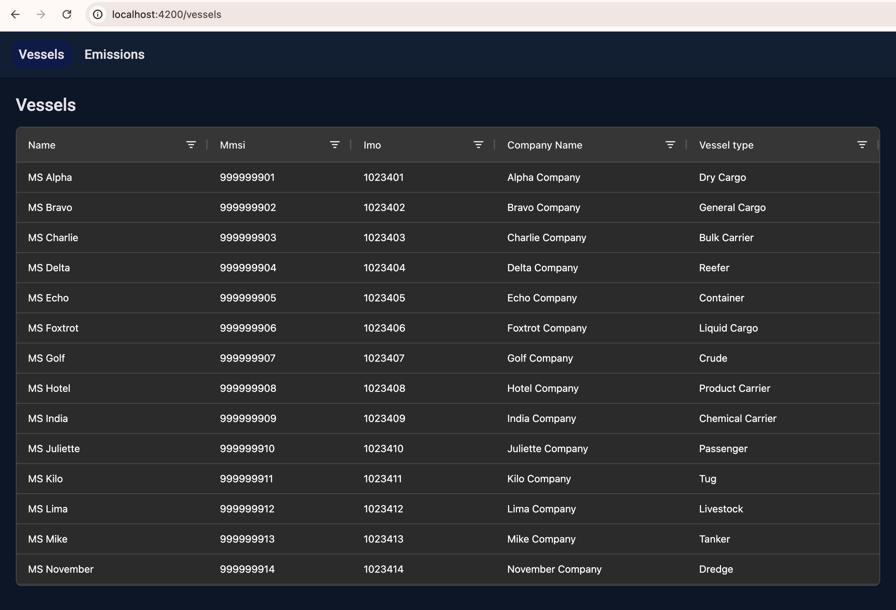
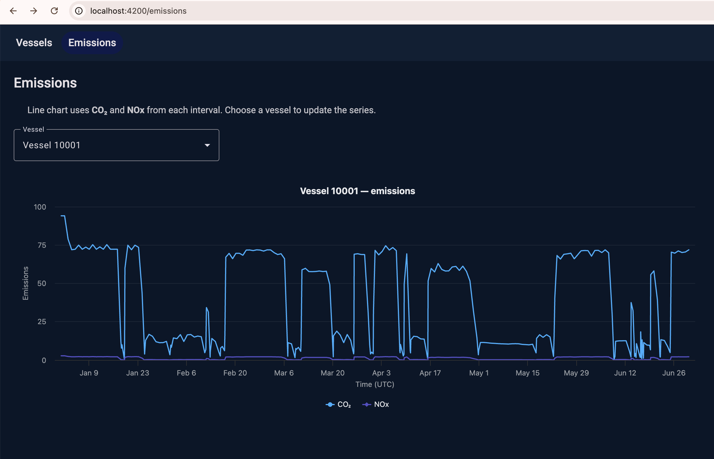

# Navtor App

Angular workspace for exploring **vessels** and **emissions** data: a lazy-loaded shell with navigation, AG Grid for fleet listing, and Highcharts for emission time series backed by NgRx on the emissions route.


<a alt="Nx logo" href="https://nx.dev" target="_blank" rel="noreferrer"></a> Built with [Nx](https://nx.dev) and [Angular](https://angular.dev).

## Requirements

- **Node.js** (LTS recommended; matches CI/local tooling)
- **npm** (lockfile: `package-lock.json`)

## Quick start

```bash
npm install
npm start
```

The dev server runs the `navtor-app` application (default Nx serve target). Open the URL shown in the terminal (typically `http://localhost:4200`).

## Scripts

| Command         | Description                    |
| --------------- | ------------------------------ |
| `npm start`     | Serve `navtor-app` in dev mode |
| `npm run build` | Production build               |
| `npm test`      | Unit tests (Jest)              |

## Features

### Vessels

- Lazy route: `/vessels`
- Loads fleet data from JSON endpoint (cached in `FetchData` via `shareReplay`).
- **AG Grid** with the v33+ **Theming API** (Quartz + dark color scheme). Do not mix legacy `ag-theme-*.css` imports with the `[theme]` binding.



### Emissions

- Lazy route: `/emissions`
- **NgRx** feature state colocated under `src/app/features/emissions/state/` (registered on the route with `provideState` / `provideEffects`).
- **EmissionsFacade** exposes selectors and `loadEmissions()`.
- **Highcharts** line chart (CO₂ and NOx) with a **vessel** dropdown; `provideHighcharts()` is registered in `app.config.ts`.



## Tech stack

- **Angular** ~21, standalone components, zoneless-friendly Jest setup
- **Angular Material** — shell navigation and form controls
- **Nx** — workspace and `navtor-app` project targets
- **NgRx** (Store, Effects, Store Devtools in development)
- **AG Grid Community** + **Highcharts** + **RxJS**

## Project layout (high level)

```
src/
  app/
    app.config.ts          # Router, HttpClient, animations, Highcharts, NgRx root
    app.routes.ts          # Lazy routes; emissions NgRx providers on `/emissions`
    features/
      vessels/             # AG Grid + FetchData
      emissions/           # Chart + facade + state/
    models/                # Vessel, emission DTOs
    nav/                   # Top navigation
    services/
      fetch-data.ts        # HTTP + shareReplay caching for exercise JSON URLs
```

## Global styling

- **Material** dark theme and navy shell variables live in `src/styles.scss`.
- Feature layout helpers (e.g. `.feature-page`) are global so lazy feature templates pick them up consistently.
